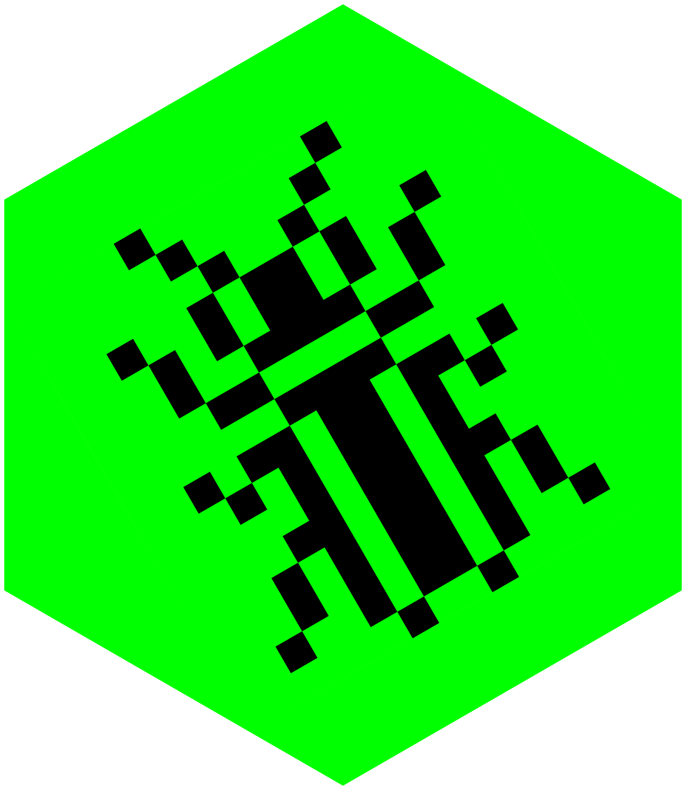

<!-- README.md is generated from README.Rmd. Please edit that file -->

```{r setup, include = FALSE}
knitr::opts_chunk$set(
  echo = FALSE,
  warning = FALSE,
  dev = "png",
  bg = "transparent"
)
```

```{r attach-pkgs, message=FALSE}
# Attach packages
suppressPackageStartupMessages({
  library(emoji)
  library(ggplot2)
  library(knitr)
  library(lubridate)
})
```

```{r fetch-post-names}
# Get all the internal post paths
post_paths <-
  list.files("posts", pattern = ".qmd$", full.names = TRUE, recursive = TRUE)

# Extract title and date from each post
get_post_info <- function(post_path) {
  post_lines <- readLines(post_path, warn = FALSE)

  title_rx <- "title:"
  date_rx <- "date:"

  title_i <- grep(title_rx, post_lines)[1]
  date_i <- grep(date_rx, post_lines)[1]

  post_title <- trimws(gsub(title_rx, "", post_lines[title_i]))
  post_title <- gsub("^\'|\'$|^\"|\"$", "", post_title)
  post_date <- trimws(gsub(date_rx, "", post_lines[date_i]))

  data.frame(title = post_title, publish_date = ymd(post_date))
}

# Get title and date of every post
post_info <- lapply(post_paths, function(path) get_post_info(path))
posts <- do.call(rbind, post_info)

# Generate a web link to each post
posts$link <- paste0("https://www.rostrum.blog/", dirname(post_paths))

# Invert order, so latest is at the top
posts <- posts[rev(row.names(posts)), ]
```

```{r date-bin}
# A dataframe with one row per day since the blog's first post
all_dates <- data.frame(
  publish_date = as_date(ymd(min(posts$publish_date)):today())
)

# Left join posts to dates
post_timeline <- merge(all_dates, posts, by = "publish_date", all.x = TRUE)

# Add a 'binary' column: 1 if there was a post that day, NA if not
post_timeline$bin <- ifelse(is.na(post_timeline$title), NA_real_, 1)
date_bin_wth_dupes <- post_timeline[, c("publish_date", "bin")]

# Remove duplicates because sometimes there's more than one post per day
date_bin <- date_bin_wth_dupes[!duplicated(date_bin_wth_dupes), ]
```

```{r date-calcs}
first_date <- min(posts$publish_date)
last_date <- max(posts$publish_date)
range_days <- as.numeric(last_date - first_date)
range_years <- round(range_days / 365, 1)
n_posts <- nrow(posts)
days_per_post <- round(range_days / n_posts)
posts_per_day <- n_posts / range_days
posts_per_month <- round(posts_per_day * 30, 1)
```

```{r plot}
# Create plot object
p <- ggplot(date_bin) +
  geom_segment(
    aes(
      x = publish_date,
      xend = publish_date,
      y = bin - 1,
      yend = bin + 1
    ),
    color = "#00FF00",
    alpha = 0.7,
    linewidth = 1
  ) +
  scale_x_continuous(expand = c(0, 0)) +
  scale_y_continuous(expand = c(0, 0)) +
  theme(
    legend.position = "none",
    panel.grid = element_blank(),
    axis.title = element_blank(),
    axis.text = element_blank(),
    axis.ticks = element_blank(),
    axis.ticks.length = unit(0, "pt"),
    panel.background = element_rect(fill = NA, color = NA),
    plot.background = element_rect(fill = NA, color = NA),
    plot.margin = margin(0, 0, 0, 0)
  )
```



# rostrum-blog-2

<!-- badges: start -->
[![rostrum.blog posts](https://img.shields.io/badge/rostrum.blog-black?style=flat&labelColor=00ff00&logo=data%3Aimage%2Fgif%3Bbase64%2CR0lGODdhoACgAJEAAAAAAP%2F%2F%2FwAAAAAAACH5BAlkAAIALAAAAACgAKAAAAL%2FlI%2BpywgPY5u02hQzuLz7r0nfSBohVKbqdT7rS7UbTMNyjR93zoNtX9sBh7EfcSU8Kh3GJSnpVEKjnCkVaL0WT1pps2vJgr1cp3gMPufU6Cs7%2BG233zS6nByK2u%2FEPTLO1%2BWnMhi4BjhUaAhXtqS4aIOIJQmJpvhYqXVJmbm42dgZ%2BpkXWjqqUWrKOYGZioc60urat9ogOzsJ2nGLy3Oa0VtVy3AmUzy8wMuCrHBsTErMjCH9pytszfQMG40dRk34bcKpDZ0cLqDs3V3hTI5ie57OHj%2FuLsJdvnv%2BRL%2BObv8O3zYP8rbku3YwG0BW%2FRLmcjjPH8CA5vwxtIjj172K%2FwvhYRQITE67gc0mzgC5seRHS%2FUkmrwI8d%2FKMSNDotQGk%2BS0mWlaxjR5kqNOhUMN1Uy5s%2BNNFx5j3jlKUaVSoTapIvXks6i4iTmrStXKByrTpca6XtWxz0xWr0ntmY3ali1Wl3SnfpWLlqeghkDdxkrriG9fcvz0ahI8%2BFlhpyIRJ9YIdy5jso%2FBvh2bCXLlyVYjG3W82XJT0XNAhz4bkTNN06cx6zPshnXrxaQzv1TLNZg6u7Ry6zboN7Dv36Pd6blNvDhh3LyTEzXOPLjzu8uFN58u83oPoNg7K44Ovfvz6q%2FCi0%2FRuuz5w%2Blhr6%2FWvvZ7RvHxzn9Y3%2FP97fnt7%2F8%2F1J9%2B%2F2UUoIAD1lGgawf6kmBQ54mlHmVrkUedgQTWJV2F30mIoX8A%2FoScdxGKCOFxHVIYF4rj4aSchfSBxV2LG5I4oYsInsgihyAOp6GDve2oXXYZppijiCYCOeSKM%2FZYInioCWkekzUuSaSCiUw5opQ4Uqmkj3tt6WVeQTbZCZk0gnlZmIGYqSWS%2FhX0IYxYslmlmmFhmSadXaqCpoxZ1pkmn24%2BGSNZgYqCp596iilfT33qKOejtknaZqSD2hgMhIsuaKSiiXKamqVJMuohqFtdyiWpT5p6qqhRAsrqoZC%2BCdh6mn4aa6ezElrrg3PimiusuwoIJ6I81nmre4L%2Fjtrqq10WW9qxz%2F6qrLFjhlhpqb8Veiaqf3bHbba8SotduMhSq1ov5k4LJrQskdusiqoW6Su8UMobL73qAnsupcJO6m2e%2FO5pravjXuuvZAYTi%2B2%2FPS5La7sDz2vlZwlT%2FC3GsgK8cMX5pvqxne5GcnHIm96LqaMBe1oyyh7f2fK6GvsJ8cEdZxzyxpWcLHPONBccsbc89%2FrjzQLHTPSVSNt78lMTm%2Fy0y3Y6vTTCK5cZdc9S6wzJ0ExHTfXV3Rr9c7TpEjzsy5pNfeHZM6ctsmlHNor22EHT%2FXZ5q5Ztt83a6qp3ynWLy7B7IzuM0M1N833E2keL%2FZrb6MnNMuSJPv9NsuRbV062D9V6rnmyli%2FzOceYIx7s5IYnnbrjqWeOt8%2Bvwxf75rODs3rpt7t%2Bu%2Bqhsx4s773TdvrgkBQAADs%3D)](https://www.rostrum.blog)
[](https://creativecommons.org/licenses/by-nc-sa/4.0/)
[](https://app.netlify.com/sites/rostrum-blog/deploys)
<!-- badges: end -->

## What

`r emoji("floppy_disk")` Source files for [rostrum.blog](https://www.rostrum.blog/).

`r emoji("technologist")` A blog for realised showerthoughts and concept noodlings with R and Python (mostly). 

`r emoji("dancers")` From your hosts: [Matt Dray](https://www.matt-dray.com/) and [Adriana De Palma](https://adrianadepalma.com/).

## Posts

`r emoji("new")` The latest post: [`r posts$title[1]`](`r posts$link[1]`).

<details><summary>`r emoji("open_file_folder")` Expand a full list of posts.</summary>
```{r posts-table}
posts_table <- posts[, "publish_date", drop = FALSE]
posts_table[["title_url"]] <-
  paste0("[", posts[["title"]], "](", posts[["link"]], ")")
names(posts_table) <- c("Date", "Title")
kable(posts_table)
```
</details><div>

## Rate

`r emoji("1234")` The blog has had `r n_posts` posts in the (roughly) `r range_years` years between the first (`r first_date``r if (format(today(), "%m-%d") == format(min(posts$publish_date), "%m-%d")) emoji::emoji("balloon")`) and latest (`r last_date`):

```{r plot-out, fig.height=1, fig.width=10, fig.alt="A 2D chart where each point represents a published blog post on a Y axis of time spanning from 2018 to the present."}
p
```

`r emoji("date")` That's about one post every `r days_per_post` days or `r posts_per_month` per month.

## Tools

`r emoji("pencil")` Generated with [Quarto](https://quarto.org/).

`r emoji("cloud")` Deployed with [Netlify](https://www.netlify.com/).

`r emoji("anatomical_heart")` Written by humans.

## Last update

`r emoji("three_o_clock")` `r format(Sys.time(), "%Y-%m-%d at %H:%M")`.
