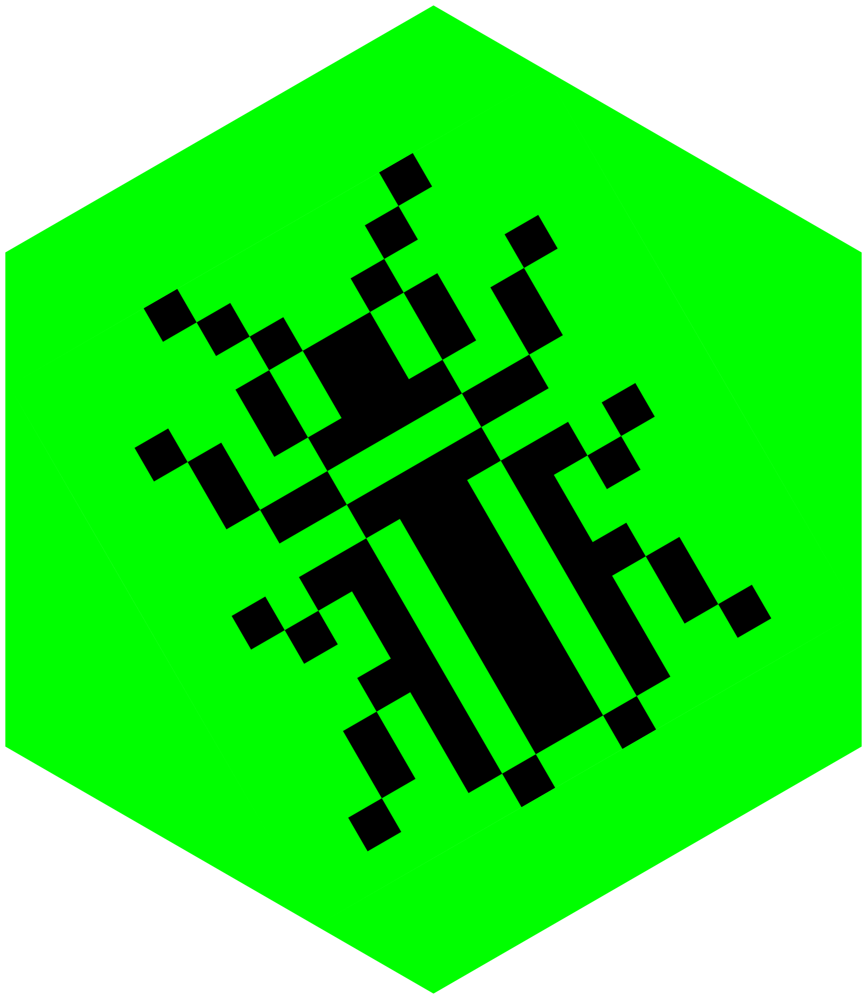

<!-- README.md is generated from README.Rmd. Please edit that file -->

# rostrum-blog

<!-- badges: start -->

<!-- badges: end -->

Source files for [rostrum.blog](https://www.rostrum.blog/): fun and
learning with the R language.

Built with [Quarto](https://quarto.org/) and deployed with
[Netlify](https://www.netlify.com/).

## Stats

🔢 There have been 154 posts on [the blog](https://www.rostrum.blog/)
since 2018-04-14.

📅 That’s a post roughly every 13 days, or about 2.4 posts per month.

🆕 The latest post was published 2 day(s) ago: [Object of type closure
can shut
up](https://www.rostrum.blog/2023-08-19-find-bad-names/index.qmd).

📈 Posts over time:

📂 Click to expand a full list of posts

|     | Date       | Title                                                                                                                              |
|:----|:-----------|:-----------------------------------------------------------------------------------------------------------------------------------|
| 154 | 2023-08-19 | [Object of type closure can shut up](https://www.rostrum.blog/2023-08-19-find-bad-names/index.qmd)                                 |
| 153 | 2023-08-01 | [One weird trick to {monetize} your R package](https://www.rostrum.blog/2023-08-01-monetize/index.qmd)                             |
| 152 | 2023-07-15 | [Save high scores for your R game](https://www.rostrum.blog/2023-07-15-hiscore/index.qmd)                                          |
| 151 | 2023-06-21 | [Convert a Word table to Markdown](https://www.rostrum.blog/2023-06-21-wordup-tables/index.qmd)                                    |
| 150 | 2023-06-13 | [Panic! In The Toolshed](https://www.rostrum.blog/2023-06-13-panic-in-the-toolshed/index.qmd)                                      |
| 149 | 2023-06-11 | [Extract run data from Apple Health (redux)](https://www.rostrum.blog/2023-06-11-apple-health-redux/index.qmd)                     |
| 148 | 2023-06-07 | [Rectangularise Word tables extracted by {officer}](https://www.rostrum.blog/2023-06-07-rectangular-officer/index.qmd)             |
| 147 | 2023-05-10 | [Recreating a dataviz with {ggplot2}](https://www.rostrum.blog/2023-05-10-spear-ggplot2/index.qmd)                                 |
| 146 | 2023-05-07 | [Automate {blogdown} to Quarto](https://www.rostrum.blog/2023-05-07-bd2q/index.qmd)                                                |
| 145 | 2023-04-23 | [Matt Dray Teaches (Data) Typing](https://www.rostrum.blog/2023-04-23-type-convert/index.qmd)                                      |
| 144 | 2023-04-02 | [R is a game engine, fight me](https://www.rostrum.blog/2023-04-02-splendid-r-games/index.qmd)                                     |
| 143 | 2023-03-16 | [Playgrounds with WebR and Quarto](https://www.rostrum.blog/2023-03-16-webr-quarto/index.qmd)                                      |
| 142 | 2023-03-15 | [Fun and learning. In a dungeon!](https://www.rostrum.blog/2023-03-15-in-a-dungeon/index.qmd)                                      |
| 141 | 2023-03-03 | [I can’t be parsed, mate](https://www.rostrum.blog/2023-03-03-getparsedata/index.qmd)                                              |
| 140 | 2023-02-26 | [Repaying Tom Nook with {S7}](https://www.rostrum.blog/2023-02-26-nook-s7/index.qmd)                                               |
| 139 | 2023-02-09 | [Porting a Twitter bot to Mastodon](https://www.rostrum.blog/2023-02-09-londmapbotstodon/index.qmd)                                |
| 138 | 2023-02-02 | [Wrapping PokéAPI with {trapinch}](https://www.rostrum.blog/2023-02-02-trapinch/index.qmd)                                         |
| 137 | 2023-01-08 | [Stiliyan Petrov: Jesus?](https://www.rostrum.blog/2023-01-08-petrov/index.qmd)                                                    |
| 136 | 2023-01-06 | [.-././–/—/.-./…/.](https://www.rostrum.blog/2023-01-06-remorse/index.qmd)                                                         |
| 135 | 2023-01-04 | [Ding! Sound effects in {r.oguelike}](https://www.rostrum.blog/2023-01-04-rogue-sfx/index.qmd)                                     |
| 134 | 2022-12-11 | [Animate sprites in R with {pixeltrix}](https://www.rostrum.blog/2022-12-11-pixeltrix-animate/index.qmd)                           |
| 133 | 2022-11-13 | [Tamagotchi in R?](https://www.rostrum.blog/2022-11-13-tamRgo/index.qmd)                                                           |
| 132 | 2022-09-24 | [Interactive pixel art in R with {pixeltrix}](https://www.rostrum.blog/2022-09-24-pixeltrix/index.qmd)                             |
| 131 | 2022-09-13 | [You are a halfling, trying to harvest {potato}](https://www.rostrum.blog/2022-09-13-potato/index.qmd)                             |
| 130 | 2022-09-07 | [EARL 22: {a11ytables} for better spreadsheets](https://www.rostrum.blog/2022-09-07-earl22/index.qmd)                              |
| 129 | 2022-08-11 | [Two RStudio Addins: {quartostamp} and {snorkel}](https://www.rostrum.blog/2022-08-11-quartostamp-snorkel/index.qmd)               |
| 128 | 2022-07-22 | [Fixing londonmapbot for {rtweet} v1.0](https://www.rostrum.blog/2022-07-22-mapbot-rtweet-v1/index.qmd)                            |
| 127 | 2022-07-08 | [Stop opening the same RStudio Project twice](https://www.rostrum.blog/2022-07-08-rproj-dupes/index.qmd)                           |
| 126 | 2022-06-28 | [An isometric dungeon chase in R](https://www.rostrum.blog/2022-06-28-isometric-dungeon/index.qmd)                                 |
| 125 | 2022-06-10 | [Automated pathfinding in {r.oguelike}](https://www.rostrum.blog/2022-06-10-basic-search/index.qmd)                                |
| 124 | 2022-06-07 | [Down with R’s assignment flamewars!](https://www.rostrum.blog/2022-06-07-assign-down/index.qmd)                                   |
| 123 | 2022-06-01 | [Try R v4.2 in your browser](https://www.rostrum.blog/2022-06-01-try-r/index.qmd)                                                  |
| 122 | 2022-05-01 | [Simple procedural dungeons in R](https://www.rostrum.blog/2022-05-01-dungeon/index.qmd)                                           |
| 121 | 2022-04-27 | [Turn the {tide} on R’s secret spreadsheet editor](https://www.rostrum.blog/2022-04-27-tide/index.qmd)                             |
| 120 | 2022-04-25 | [Building a {r.oguelike} in R](https://www.rostrum.blog/2022-04-25-r.oguelike-dev/index.qmd)                                       |
| 119 | 2022-03-31 | [Interactive maps of Hastings Half Marathon](https://www.rostrum.blog/2022-03-31-hastings-half/index.qmd)                          |
| 118 | 2022-03-15 | [Reproducible {distill} posts with {renv} profiles](https://www.rostrum.blog/2022-03-15-renv-profiles/index.qmd)                   |
| 117 | 2022-02-19 | [Add in an RStudio Addin to add in backticks](https://www.rostrum.blog/2022-02-19-backtick/index.qmd)                              |
| 116 | 2022-02-12 | [londonmapbot at LondonR](https://www.rostrum.blog/2022-02-12-mapbot-londonr/index.qmd)                                            |
| 115 | 2022-02-04 | [Introduce me to your {soccercolleagues}](https://www.rostrum.blog/2022-02-04-soccercolleagues/index.qmd)                          |
| 114 | 2022-01-19 | [Impress with {keypress} minigames](https://www.rostrum.blog/2022-01-19-keypress/index.qmd)                                        |
| 113 | 2022-01-14 | [Wordle, twirdle and eldrow](https://www.rostrum.blog/2022-01-14-wordle/index.qmd)                                                 |
| 112 | 2022-01-07 | [The most popular Animal Crossing villagers](https://www.rostrum.blog/2022-01-07-acnh-swipe-results/index.qmd)                     |
| 111 | 2021-12-30 | [Your workout route (in three dimensions!)](https://www.rostrum.blog/2021-12-30-gpx3d/index.qmd)                                   |
| 110 | 2021-11-27 | [{itdepends} on {lubridate}](https://www.rostrum.blog/2021-11-27-lubridate-fns/index.qmd)                                          |
| 109 | 2021-11-27 | [R has obscenely long function names](https://www.rostrum.blog/2021-11-27-long-fns/index.qmd)                                      |
| 108 | 2021-11-07 | [Deep fried memes in R](https://www.rostrum.blog/2021-11-07-deepfry/index.qmd)                                                     |
| 107 | 2021-11-04 | [Get coordinates from fictitious maps](https://www.rostrum.blog/2021-11-04-kanto-locator/index.qmd)                                |
| 106 | 2021-10-05 | [Reveal a hidden gorilla with {magick}](https://www.rostrum.blog/2021-10-05-gorilla/index.qmd)                                     |
| 105 | 2021-10-03 | [{ActionSquirrel}: a game in the R console](https://www.rostrum.blog/2021-10-03-squirrel/index.qmd)                                |
| 104 | 2021-09-14 | [Wot3LdnEmojis](https://www.rostrum.blog/2021-09-14-wot3ldnemojis/index.qmd)                                                       |
| 103 | 2021-09-12 | [Extract punctuation from books with R](https://www.rostrum.blog/2021-09-12-extract-punct/index.qmd)                               |
| 102 | 2021-08-31 | [Auto-label closing parentheses in RStudio](https://www.rostrum.blog/2021-08-31-add-biscuits/index.qmd)                            |
| 101 | 2021-08-27 | [Exploring R package startup messages](https://www.rostrum.blog/2021-08-27-zzz/index.qmd)                                          |
| 100 | 2021-08-27 | [Adding a Shiny app to {dehex}](https://www.rostrum.blog/2021-08-27-dehex-app/index.qmd)                                           |
| 99  | 2021-08-10 | [Read a hex colour code with {dehex}](https://www.rostrum.blog/2021-08-10-dehex/index.qmd)                                         |
| 98  | 2021-07-31 | [OG emoji SVGs](https://www.rostrum.blog/2021-07-31-og-emoji-svg/index.qmd)                                                        |
| 97  | 2021-07-25 | [Make an art gallery with {bs4cards}](https://www.rostrum.blog/2021-07-25-faxcrayon/index.qmd)                                     |
| 96  | 2021-07-23 | [What colour is London?](https://www.rostrum.blog/2021-07-23-london-colour/index.qmd)                                              |
| 95  | 2021-07-15 | [EXPOSED: a Kiwi conspiracy built into R!](https://www.rostrum.blog/2021-07-15-dollar-dollar/index.qmd)                            |
| 94  | 2021-07-10 | [Decay is inevitable, accept {linkrot}?](https://www.rostrum.blog/2021-07-10-linkrot/index.qmd)                                    |
| 93  | 2021-07-05 | [\#RecreationThursday: a LeWitt Shiny app](https://www.rostrum.blog/2021-07-05-recreate-lewitt/index.qmd)                          |
| 92  | 2021-06-28 | [Very simple pixel art in R](https://www.rostrum.blog/2021-06-28-pixel-art/index.qmd)                                              |
| 91  | 2021-06-26 | [Generate an {emojiscape}](https://www.rostrum.blog/2021-06-26-emojiscape/index.qmd)                                               |
| 90  | 2021-06-21 | [Recreation Thursday: Hlito with base R](https://www.rostrum.blog/2021-06-21-recreate-hlito/index.qmd)                             |
| 89  | 2021-06-08 | [Recreating Spear’s \#CottonViz in base R](https://www.rostrum.blog/2021-06-08-recreate-spear/index.qmd)                           |
| 88  | 2021-05-22 | [Mission Across the Isle of Wight](https://www.rostrum.blog/2021-05-22-mission-across-iow/index.qmd)                               |
| 87  | 2021-05-07 | [Encrypt and host a knitted R Markdown file](https://www.rostrum.blog/2021-05-07-encrypted-rmd/index.qmd)                          |
| 86  | 2021-04-18 | [Make the simplest R package with {pico}](https://www.rostrum.blog/2021-04-18-pico-pkg/index.qmd)                                  |
| 85  | 2021-04-14 | [Up-to-date blog stats in your README](https://www.rostrum.blog/2021-04-14-gha-readme/index.qmd)                                   |
| 84  | 2021-04-10 | [Convert R to cron to English with {dialga}](https://www.rostrum.blog/2021-04-10-dialga/index.qmd)                                 |
| 83  | 2021-03-23 | [Apple Health and Nike Run Club with {xml2}](https://www.rostrum.blog/2021-03-23-xml-health/index.qmd)                             |
| 82  | 2021-03-23 | [Make a {shiny} app README badge](https://www.rostrum.blog/2021-03-23-shiny-badge/index.qmd)                                       |
| 81  | 2021-03-13 | [Protect yourself from equals assignment!](https://www.rostrum.blog/2021-03-13-assign/index.qmd)                                   |
| 80  | 2021-03-02 | [A tiny {shiny} flag challenge](https://www.rostrum.blog/2021-03-02-randoflag/index.qmd)                                           |
| 79  | 2021-02-27 | [Typo-shaming my Git commits](https://www.rostrum.blog/2021-02-27-typos/index.qmd)                                                 |
| 78  | 2021-02-21 | [\#GithubSkyline but hear me out](https://www.rostrum.blog/2021-02-21-skyphone/index.qmd)                                          |
| 77  | 2021-02-02 | [What does a year of COVID-19 sound like?](https://www.rostrum.blog/2021-02-02-sonify-covid/index.qmd)                             |
| 76  | 2021-01-28 | [R’s names and values as anchovy pizza](https://www.rostrum.blog/2021-01-28-adv-r-names/index.qmd)                                 |
| 75  | 2021-01-04 | [Play Pokémon’s Safari Zone in R](https://www.rostrum.blog/2021-01-04-safar6/index.qmd)                                            |
| 74  | 2020-12-30 | [Accessible colour contrasts with {coloratio}](https://www.rostrum.blog/2020-12-30-coloratio/index.qmd)                            |
| 73  | 2020-12-20 | [Mapping londonmapbot tweets with {leaflet}](https://www.rostrum.blog/2020-12-20-londonmapbot-leaflet/index.qmd)                   |
| 72  | 2020-12-08 | [Sending {postcards} with Netlify and Namecheap](https://www.rostrum.blog/2020-12-08-postcard/index.qmd)                           |
| 71  | 2020-11-21 | [The US electoral college with {tilegramsR}](https://www.rostrum.blog/2020-11-21-president-tilegram/index.qmd)                     |
| 70  | 2020-11-14 | [Translate R to English with {r2eng}](https://www.rostrum.blog/2020-11-14-hello-r2eng/index.qmd)                                   |
| 69  | 2020-09-27 | [Hit your reproducibility {targets}](https://www.rostrum.blog/2020-09-27-targets-dsfest/index.qmd)                                 |
| 68  | 2020-09-21 | [A Twitter bot with {rtweet} and GitHub Actions](https://www.rostrum.blog/2020-09-21-londonmapbot/index.qmd)                       |
| 67  | 2020-09-16 | [Friendship ended with Google Analytics](https://www.rostrum.blog/2020-09-16-goatcounter-blogdown/index.qmd)                       |
| 66  | 2020-09-15 | [Rate my RStudio setup](https://www.rostrum.blog/2020-09-15-rstudio-settings/index.qmd)                                            |
| 65  | 2020-09-12 | [{units} of uncleaned herring](https://www.rostrum.blog/2020-09-12-herring-units/index.qmd)                                        |
| 64  | 2020-08-09 | [GitHub Actions for R packages](https://www.rostrum.blog/2020-08-09-ghactions-pkgs/index.qmd)                                      |
| 63  | 2020-07-11 | [Set up R on Raspberry Pi for blogging](https://www.rostrum.blog/2020-07-11-raspberry/index.qmd)                                   |
| 62  | 2020-06-14 | [Take a {ghdump} to download GitHub repos](https://www.rostrum.blog/2020-06-14-ghdump/index.qmd)                                   |
| 61  | 2020-06-06 | [Animal Crossing Tinder with {shinysense}](https://www.rostrum.blog/2020-06-06-acnh-swipe/index.qmd)                               |
| 60  | 2020-05-16 | [Postcode pandemonium with {data.table}](https://www.rostrum.blog/2020-05-16-postcode-pandemonium/index.qmd)                       |
| 59  | 2020-05-08 | [Make a README badge with {badgr}](https://www.rostrum.blog/2020-05-08-badgr/index.qmd)                                            |
| 58  | 2020-05-02 | [AGÜEROOOOO with {ggsoccer} and {gganimate}](https://www.rostrum.blog/2020-05-02-aguerooooo/index.qmd)                             |
| 57  | 2020-04-17 | [Owning the shame of my old R code](https://www.rostrum.blog/2020-04-17-r-self-shame/index.qmd)                                    |
| 56  | 2020-04-05 | [Plotception with {ggpattern}](https://www.rostrum.blog/2020-04-05-yo-dawg/index.qmd)                                              |
| 55  | 2020-04-04 | [Repaying Tom Nook with {R6}](https://www.rostrum.blog/2020-04-04-repaying-tom-nook-with-r6/index.qmd)                             |
| 54  | 2020-03-22 | [Ninja scaffolding for {xaringan}](https://www.rostrum.blog/2020-03-22-ninja-scaffold/index.qmd)                                   |
| 53  | 2020-03-12 | [Iterate parameterised {xaringan} reports](https://www.rostrum.blog/2020-03-12-knit-with-params/index.qmd)                         |
| 52  | 2020-02-27 | [Dear past self: blog](https://www.rostrum.blog/2020-02-27-get-blogging/index.qmd)                                                 |
| 51  | 2020-02-05 | [A Pokémon sprite carousel with {slickR}](https://www.rostrum.blog/2020-02-05-slickr/index.qmd)                                    |
| 50  | 2020-01-31 | [{orderly} and {drake} at Bioinformatics London](https://www.rostrum.blog/2020-01-31-reprobioinformatics/index.qmd)                |
| 49  | 2020-01-22 | [Reproducibility in R: three things](https://www.rostrum.blog/2020-01-22-repro-three-things/index.qmd)                             |
| 48  | 2019-12-27 | [Packages that Sparked Joy in 2019](https://www.rostrum.blog/2019-12-27-pkgs-2019/index.qmd)                                       |
| 47  | 2019-12-23 | [Handle London travel data with {oystr}](https://www.rostrum.blog/2019-12-23-oystr/index.qmd)                                      |
| 46  | 2019-12-08 | [{altcheckr}: check image alt text from R](https://www.rostrum.blog/2019-12-08-altcheckr/index.qmd)                                |
| 45  | 2019-11-27 | [A pivotal change to Software Carpentry](https://www.rostrum.blog/2019-11-27-pivot/index.qmd)                                      |
| 44  | 2019-11-02 | [Tidyswirl: a tidyverse Swirl course](https://www.rostrum.blog/2019-11-02-tidyswirl/index.qmd)                                     |
| 43  | 2019-11-01 | [Build an R package with {usethis}](https://www.rostrum.blog/2019-11-01-usethis/index.qmd)                                         |
| 42  | 2019-10-21 | [Git going: Git and GitHub](https://www.rostrum.blog/2019-10-27-git-github/index.qmd)                                              |
| 41  | 2019-10-22 | [{blogsnip}: an RStudio Addins package](https://www.rostrum.blog/2019-10-22-blogsnip/index.qmd)                                    |
| 40  | 2019-09-20 | [How do you pronounce {dplyr}?](https://www.rostrum.blog/2019-09-20-say-package/index.qmd)                                         |
| 39  | 2019-09-12 | [The Carpentries: teach with live coding](https://www.rostrum.blog/2019-09-12-live-code/index.qmd)                                 |
| 38  | 2019-09-06 | [{blogdown}: add metadata to Lithium-themed posts](https://www.rostrum.blog/2019-09-06-lithium-metadata/index.qmd)                 |
| 37  | 2019-08-25 | [{holepunch} a {drake} and put it in a Binder](https://www.rostrum.blog/2019-08-25-holepunch-drake/index.qmd)                      |
| 36  | 2019-07-23 | [Can {drake} RAP?](https://www.rostrum.blog/2019-07-23-can-drake-rap/index.qmd)                                                    |
| 35  | 2019-06-20 | [The Mountain Goats with {trelliscopejs}](https://www.rostrum.blog/2019-06-20-goat-scope/index.qmd)                                |
| 34  | 2019-06-11 | [A GitHub repo template for R analysis](https://www.rostrum.blog/2019-06-11-r-repo-template/index.qmd)                             |
| 33  | 2019-05-31 | [Make a {brickr} soccer player](https://www.rostrum.blog/2019-05-31-brickr-soccer/index.qmd)                                       |
| 32  | 2019-05-24 | [Package a {xaringan} template](https://www.rostrum.blog/2019-05-24-xaringan-template/index.qmd)                                   |
| 31  | 2019-05-10 | [Teach a person to {swirl}](https://www.rostrum.blog/2019-05-10-swirlify/index.qmd)                                                |
| 30  | 2019-04-30 | [Markov-chaining my PhD thesis II](https://www.rostrum.blog/2019-04-30-markov-chain-phd-2/index.qmd)                               |
| 29  | 2019-04-25 | [Generate The Mountain Goats lyrics](https://www.rostrum.blog/2019-04-25-gen-tmg-lyrics/index.qmd)                                 |
| 28  | 2019-04-14 | [A year of rostrum.blog](https://www.rostrum.blog/2019-04-14-one-year/index.qmd)                                                   |
| 27  | 2019-04-07 | [Fix leaky pipes in R](https://www.rostrum.blog/2019-04-07-fix-leaky-pipes/index.qmd)                                              |
| 26  | 2019-03-18 | [A tidyverse functions quiz with {learnr}](https://www.rostrum.blog/2019-03-18-tidyverse-quiz/index.qmd)                           |
| 25  | 2019-03-04 | [Web scraping the {polite} way](https://www.rostrum.blog/2019-03-04-polite-webscrape/index.qmd)                                    |
| 24  | 2019-02-27 | [What’s your Hadley Number?](https://www.rostrum.blog/2019-02-27-hadley-number/index.qmd)                                          |
| 23  | 2019-02-14 | [Graphing the Relayverse of podcasts](https://www.rostrum.blog/2019-02-14-relayverse/index.qmd)                                    |
| 22  | 2019-02-01 | [Git going: the command line](https://www.rostrum.blog/2019-02-01-git-going-cl/index.qmd)                                          |
| 21  | 2019-01-18 | [Map deer-vehicle colisions with {shiny}](https://www.rostrum.blog/2019-01-18-deer-collisions/index.qmd)                           |
| 20  | 2019-01-04 | [Motivate yourself with an .Rprofile](https://www.rostrum.blog/2019-01-04-rprofile-motivate/index.qmd)                             |
| 19  | 2018-12-24 | [Travel the NBA with {rvest}, {leaflet} and {osrm}](https://www.rostrum.blog/2018-12-24-nba-travel/index.qmd)                      |
| 18  | 2018-11-29 | [Change your {blogdown} fonts](https://www.rostrum.blog/2018-11-29-fontface-lithium/index.qmd)                                     |
| 17  | 2018-11-25 | [Quantify colour by {magick}](https://www.rostrum.blog/2018-11-25-art-of-the-possible/index.qmd)                                   |
| 16  | 2018-11-21 | [Waggle dance with {ggbeeswarm} and {emoGG}](https://www.rostrum.blog/2018-11-21-waggle-dance/index.qmd)                           |
| 15  | 2018-11-04 | [Teaching R with Pokémon Go data](https://www.rostrum.blog/2018-11-04-r-train-pkmn/index.qmd)                                      |
| 14  | 2018-10-13 | [R session info info](https://www.rostrum.blog/2018-10-13-sessioninfo/index.qmd)                                                   |
| 13  | 2018-09-24 | [Knitting Club: R Markdown for beginners](https://www.rostrum.blog/2018-09-24-knitting-club/index.qmd)                             |
| 12  | 2018-09-12 | [EARL 2018: {crosstalk} in memes](https://www.rostrum.blog/2018-09-12-crosstalk-memes/index.qmd)                                   |
| 11  | 2018-07-26 | [Engifification in R with {gifski}](https://www.rostrum.blog/2018-07-26-engifification-in-r-with-gifski/index.qmd)                 |
| 10  | 2018-07-17 | [Footballers are younger than you](https://www.rostrum.blog/2018-07-17-world-cup-age-app/index.qmd)                                |
| 9   | 2018-07-12 | [How accessible is my post about accessibility?](https://www.rostrum.blog/2018-07-12-accessible-accessibility/index.qmd)           |
| 8   | 2018-06-30 | [Markov-chaining my PhD thesis](https://www.rostrum.blog/2018-06-30-markov-chain-phd/index.qmd)                                    |
| 7   | 2018-06-26 | [Iterative R Markdown reports for Dawson’s Creek](https://www.rostrum.blog/2018-06-26-mail-merge/index.qmd)                        |
| 6   | 2018-06-05 | [Tid-ye-text with {geniusr}](https://www.rostrum.blog/2018-06-05-tid-ye-text/index.qmd)                                            |
| 5   | 2018-05-25 | [Cloudy with a chance of pie](https://www.rostrum.blog/2018-05-25-cloud-pie/index.qmd)                                             |
| 4   | 2018-05-19 | [Pokéballs in Super Smash Bros](https://www.rostrum.blog/2018-05-19-pokeballs-in-super-smash-bros/index.qmd)                       |
| 3   | 2018-05-12 | [Accessibility workshop at \#Sprint18](https://www.rostrum.blog/2018-05-12-accessibility-workshop-at-sprint18/index.qmd)           |
| 2   | 2018-04-27 | [TWO DOGS IN TOILET ELDERLY LADY INVOLVED](https://www.rostrum.blog/2018-04-27-two-dogs-in-toilet-elderly-lady-involved/index.qmd) |
| 1   | 2018-04-14 | [R Trek: exploring stardates](https://www.rostrum.blog/2018-04-14-r-trek-exploring-stardates/index.qmd)                            |

## 

Updated on 2023-08-21 at 22:21.
