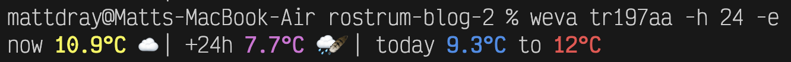

{fig-align="left" fig-alt="A screenshot of a terminal that's running the comand 'weva tr197aa -h 24 -e', which returns a one-line weather report with temperature and weather emojis for now and a day later, plus the temperature extreems for today. The temperature values are bold and coloured." width="100%"}

## tl;dr

The [{weva} R package](https://github.com/matt-dray/weva) contains a titchy command-line interface (CLI) to present an opinionated micro-weather report.

## Building some {Rapp}ort 

I’m spending more time in the terminal.

So I've been making little CLI concepts:

* [jot](https://www.rostrum.blog/posts/2025-08-25-jot/) for recording notes
* [pet](https://www.rostrum.blog/posts/2025-10-30-pet/) for a persistent cyberpet
* [tyle](https://www.rostrum.blog/posts/2026-02-01-tyle/) for a roguelike-like

These are all written in Python, which seems a more natural choice for this purpose than R[^rscript].

But I was pleased to see a recent [blog post](https://tidyverse.org/blog/2026/02/rapp-0-3-0/) about a new release of [{Rapp}](https://github.com/r-lib/Rapp), an R package to help create CLIs.

So obviously I needed to try it out.

## CLImate

But a CLI for what?

My colleagues and I have enjoyed twee weather CLIs of late, like [weathr](https://github.com/Veirt/weathr) and [wttr.in](https://github.com/chubin/wttr.in).

So, because I have no imagination: introducing the concept [{weva}](https://github.com/matt-dray/weva/) ('wevvah'[^cockney]) R package.

It does way less than those other examples and doesn't have fun ASCII graphics.
It's just a simple toy project to see how {Rapp} works, with no guarantees.
Is that enough disclaimers?

Along with {Rapp}, this was made possible by the:

* free APIs [Open-Meteo](https://open-meteo.com/) and [postcodes.io](https://postcodes.io/)[^apis], which do not require a login
* the tidyverse packages [{httr2}](https://httr2.r-lib.org/) and [{lubridate}](https://lubridate.tidyverse.org/)

### R console

From the R console, you could install[^dude] {weva} from GitHub like:

```r
pak::pak("matt-dray/weva")
```

You then use a {weva} function to install the CLI tool:

```r
weva::install_cli()
```

This will print the install location of the CLI, if successful.

### Terminal

From a terminal—not the R console—you can use `weva` to look up weather for a given UK postcode[^postcodes].

Let's compare Lands End ('top' of mainland Britain) to John o' Groats ('bottom')[^beer] as I write this.

```bash
weva tr197aa
```
```
now 10.9°C ☁️ | +1h 11.3°C ☁️ 
```

```bash
weva kw14yr
```
```
now 6.1°C ☁️ | +1h 6.3°C 🌧️🪶 
```

The one-line display has segments for the current and future temperature and weather.
There are emoji modifiers for heavy, light and freezing versions of some weather types.

Surprise, it's early March everywhere in Britain.

Hopefully your day will be brightened by the styling with [ANSI escape codes](https://en.wikipedia.org/wiki/ANSI_escape_code#Colors), assuming your terminal supports them.

#### Options

You can add some flags to adjust the settings.
Use `--hour` (or its shortcut `-h`) to adjust the number of hours for the forward-look.
Let's look one day ahead.

```bash
weva tr197aa -h 24
```
```
now 10.9°C ☁️ | +24h 7.7°C 🌧️🪶 
```

So there's light drizzle this time tomorrow and it will be cooler (did I mention it's early March in Britain).

Note that you can only look at forecasts up to the end of the day after tomorrow[^tomorrow].

Use the `--extremes` (`-e`) flag to also print a segment with today's low and high temperatures.
You can compound these options:

```bash
weva tr197aa -h 24 -e
```
```
now 10.9°C ☁️ | +24h 7.7°C 🌧️🪶 | today 9.3°C to 12°C 
```

Well, 'extremes' is perhaps a bit extreme for this temperature range.

#### Time is hard

'Now' and 'later' in this context are actually a bit awkward.

The Open-Meteo API returns the 'current' time as a quarter-hour increment, while 'hourly' information is the top of the hour.

My low-effort solution was to round 'now' to the nearest hour and declare '+1 hour' as the hour after that.

In addition, the hourly data is returned for the whole of the current day (i.e. some of it is from the past).
That means we have to match the rounded 'now' time to the list of times for today to get its index, then add the user-supplied `--hours` to find the details for the correct time in the future.

So you can only ask for a forecast for the rest of today or the following two full days.

That's a bit confusing, so you can use the `--datetime` (`-d`) option to expose the datetimes for the data in each segment of the report. 

```bash
weva tr197aa -h 24 -e -d
```
```
2026-03-01 10:00 10.9°C 🌧️🪶 | 2026-03-02 10:00 7.7°C 🌧️🪶 | 2026-03-01 9.3°C to 12°C 
```

As I write, it's 10:06 on 1 March 2026.
That's rounded to 10:00 for the 'now' time.
And so 24 hours from now is 10:00 tomorrow: 2 March 2026.

## Inside the crystal ball

What's actually happening in the code?

{weva} is just a normal R package with some exported functions to `get_latlon()`, `get_weather()` and `write_report()`.

But there's one difference: [a script](https://github.com/matt-dray/weva/blob/main/exec/weva.R) under `exec/` that contains R code that {Rapp} will reinterpret (magically?) into a CLI.

At time of writing it looks like this:

```r
#!/usr/bin/env Rapp
#| name: weva
#| description: A micro weather report with 'Open-Meteo' and 'postcodes.io' APIs

#| description: A UK postcode
postcode <- NULL

#| description: Hours from now for the 'later' segment (up to three days)
#| short: h
hours <- 1L

#| description: Show API and calculated datetimes in 'now' and 'later' segments?
#| short: d
datetimes <- FALSE

#| description: Show a segment for today's min and max temperatures?
#| short: e
extremes <- FALSE

get_latlon(postcode) |>
  get_weather() |>
  write_report(
    hours_to_forecast = hours,
    show_datetimes = datetimes,
    show_extremes = extremes
  ) |>
  cat()

```

Note in this file:

* the [shebang](https://en.wikipedia.org/wiki/Shebang_(Unix)) (`#!`)[^ricky], which gives the path to where {Rapp} is installed
* the hashpipes (`#|`) for documenting the CLI and its options
* that everything else is normal R code

{Rapp} interprets `postcode <- NULL` as a required positional argument for `weva`.
You can just type the postcode without a flag.

Conversely, the remaining options must be named, though `short` names can be used to save typing.
`--hours` (`-h`) is interpreted as an integer with a default of `1`
`--datetimes` and `--extremes` (`-d`, `-e`) are off (`FALSE`) by default, but the user can just use the flag without an argument to turn it on.

What's also nice is that {Rapp} gives us `--help` (and `--help-yaml`) for free, based on our variable documentation.

```bash
weva --help
```
```
Usage: weva [OPTIONS] <POSTCODE>

A micro weather report with 'Open-Meteo' and 'postcodes.io' APIs

Options:
  -h, --hours <HOURS>             Hours from now for the 'later' segment (up to
                                  three days)
                                  [default: 1] [type: integer]
  -d, --datetimes / --no-datetimes  Show API and calculated datetimes in 'now'
                                  and 'later' segments?
                                  [default: false]
                                  Enable with `--datetimes`.
  -e, --extremes / --no-extremes  Show a segment for today's min and max
                                  temperatures?
                                  [default: false]
                                  Enable with `--extremes`.

Arguments:
  <POSTCODE>  A UK postcode
```

In short, {Rapp} lets you write 'normal' looking R code that gets interpreted into a CLI with various types of options.

That's quite a neat, low-effort way to create a CLI.

## {Rapp}ing up

{weva} is [repeated disclaimers]. 
It would be easy to get carried away and build something even more complex.
I've achieved the content and learning I wanted, so I stop here.

In fact, I already used this tool yesterday before a trip[^greenwich].
I discovered the day was going to be overcast with some showers.
Who could have guessed?

But on more variable days, I'm reminded of [Fran](https://github.com/francisbarton)'s observation when faced with differing forecasts:

> I had better go outside and see who's right

Very wise.

### Environment {.appendix}

<details><summary>Session info</summary>
```{r sessioninfo, eval=TRUE, echo=FALSE}
cat("Last rendered:", format(Sys.time(), usetz = TRUE)); sessionInfo()
```
</details>


[^dude]: Remember: you shouldn't trust 'some dude' telling you to install random stuff from the internet.
[^postcodes]: For my purposes I don't care about weather anywhere except in the UK. I'm more likely to know the postcode than latitude-longitude, so I'm happy to limit the tool in this way.
[^beer]: Actually these postcodes are for the First & Last House pub and the John o' Groats brewery.
[^rscript]: I don't want to simply run scripts from the command line, which is what `Rscript` is for.
[^cockney]: With a respectful cockney accent.
[^tomorrow]: We don't need to forecast beyond that, because we know the weather's going to be [really dicey and unpredictable](https://en.wikipedia.org/wiki/The_Day_After_Tomorrow).
[^greenwich]: Amusingly, given my time-related pains in {weva}, we went to [Greenwich](https://en.wikipedia.org/wiki/Prime_meridian_(Greenwich)).
[^ricky]: [Important disambiguation](https://en.wikipedia.org/wiki/She_Bangs).
[^apis]: Packages [{openmeteo}](https://github.com/tpisel/openmeteo) and [{PostcodesioR}](https://docs.ropensci.org/PostcodesioR/index.html) wrap their respective APIs, but I minimised the dependencies by querying myself with {httr2}.