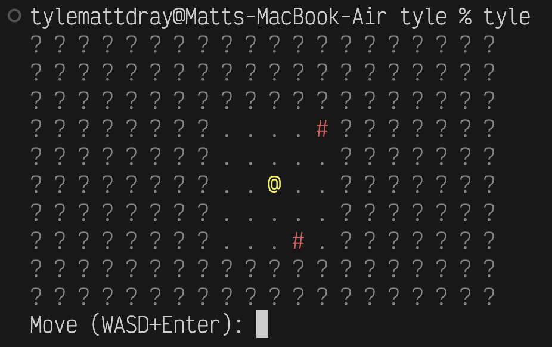

{fig-align="left" fig-alt="A 10 by 20 grid of characters printed to a macOS terminal. Tiles are mostly question-mark characters (unknown tiels). Near the midlle is an 'at' symbol (the player), surrounded within two tiles of the grid with periods (floor tiles) and hash marks (wall tiles). A prompt underneath reads 'Move (WASD)+Enter:', ready for user input." width="100%"}

## tl;dr

[tyle](https://github.com/matt-dray/tyle), my Python-CLI roguelike-like, now has fog of war.

## Grid and bare it

You may remember [tyle](https://www.rostrum.blog/posts/2026-02-01-tyle/): the beginnings of an in-terminal tile-based [roguelike](https://en.wikipedia.org/wiki/Roguelike) to help me improve my Python skills.

If it excites you, you could install the development version like `uv tool install git+https://github.com/matt-dray/tyle.git` and initiate by typing `tyle` in a terminal.

You'll get something like:

```
. . . # # . # . . . . . . . # . . . . . 
. . . . . . . . . . . . . # . . . . . . 
# . . . . . . . . . . . . # . . . . . . 
. . # # . # . . . . . . . . . . . . . . 
. . . . . . . . . . @ . . . . . . . . . 
. . . . . . . . . . # . . # . . . . . . 
. . . . . . . . . # # # . . . # . . . # 
. . . . . . # . . . . . . # . . . . . # 
. # . . # . . . . . . . . . . . . . . . 
Move (WASD+Enter): 
```

Except it'll have some colour if your terminal supports [ANSI escape codes](https://en.wikipedia.org/wiki/ANSI_escape_code#Colors).

## The big reveal

tyle could improve in many ways.
For example, the development of enemies and pathfinding, procedural dungeons, or an inventory system.

A quick win is 'fog of war'[^fog].

This phrase refers to [uncertainty when drawing up battle plans](https://en.wikipedia.org/wiki/Fog_of_war), but is also a mechanic in many videogames, including roguelikes.

A classic example is in [the Civilization series](https://en.wikipedia.org/wiki/Civilization_(series)) of games.
When you start, you cannot see the content of tiles you haven't visited.
The tiles are literally [shrouded in fog](https://civilization.fandom.com/wiki/Fog_of_war).
That keeps things interesting: will the next tile contain a barbarian hoarde or a potential city-founding location?

## Fog lights

We can introduce fog into tyle with little effort.

For lore reasons, imagine the player character is carrying a lamp that illuminates a certain number of tiles in any direction[^lamp].

How can we achieve this practically?

You may remember that tyle has a `TileGrid` class.
It has a `draw()` method to generate and print the current state of the tile map.

Previously, we drew the underlying terrain in the map by default, which is composed of traversable floor (symbol `.`) and non-traversable walls (`#`).
The only exception was to draw the player in the location given by the `Player`-class `row` and `column` properties.

We can intercept this logic to draw fog-of-war symbols by default, unless within a certain tile-range of the player, in which case we draw the terrain.

For maximum portability—and as a hat-tip to the original roguelikes—we've been using [ASCII symbols](en.wikipedia.org/wiki/ASCII) as 'graphics'.
We may as well continue for the fog.

I couldn't think of anything cleverer than simply putting a `?`, geddit.
Also it's coloured grey becuase that seems right.

## Sound the foghorn

And so the relevant `for`-loop in the `TileGrid` class takes this shape:

```python
for row in range(self.n_rows):
    row_symbols = []
    for col in range(self.n_cols):
        if self.player.row == row and self.player.col == col:
            symbol = self.player.symbol
        elif max(
            abs(self.player.row - row), abs(self.player.col - col)
        ) in range(0, self.fog):
            symbol = self.tiles[row][col].symbol
        else:
            symbol = "?"
```

So, for each row and column, print the symbol for the:

* player (`@`) if matching `Player`-class properties `row` and `column`
* terrain tile (`.` or `#`) if within `fog` number of tiles from the player
* fog (`?`) if no other conditions are met (i.e. all the remaining tiles)

In `main()` I've set `fog = 2`, so we'll see fog beyond two tiles of the player.

That gives us something like:

```
? ? ? ? ? ? ? ? ? ? ? ? ? ? ? ? ? ? ? ? 
? ? ? ? ? ? ? ? ? ? ? ? ? ? ? ? ? ? ? ? 
? ? ? ? ? ? ? ? . . # . . ? ? ? ? ? ? ? 
? ? ? ? ? ? ? ? . . . . . ? ? ? ? ? ? ? 
? ? ? ? ? ? ? ? . . @ . . ? ? ? ? ? ? ? 
? ? ? ? ? ? ? ? . . . . . ? ? ? ? ? ? ? 
? ? ? ? ? ? ? ? . . . # . ? ? ? ? ? ? ? 
? ? ? ? ? ? ? ? ? ? ? ? ? ? ? ? ? ? ? ? 
? ? ? ? ? ? ? ? ? ? ? ? ? ? ? ? ? ? ? ? 
Move (WASD+Enter): 
```

And moving left two steps gives us:

```
? ? ? ? ? ? ? ? ? ? ? ? ? ? ? ? ? ? ? ? 
? ? ? ? ? ? ? ? ? ? ? ? ? ? ? ? ? ? ? ? 
? ? ? ? ? ? ? ? ? ? ? ? ? ? ? ? ? ? ? ? 
? ? ? ? ? ? # . . . # ? ? ? ? ? ? ? ? ? 
? ? ? ? ? ? . . . . . ? ? ? ? ? ? ? ? ? 
? ? ? ? ? ? . . @ . . ? ? ? ? ? ? ? ? ? 
? ? ? ? ? ? # . . . . ? ? ? ? ? ? ? ? ? 
? ? ? ? ? ? . . . . . ? ? ? ? ? ? ? ? ? 
? ? ? ? ? ? ? ? ? ? ? ? ? ? ? ? ? ? ? ? 
? ? ? ? ? ? ? ? ? ? ? ? ? ? ? ? ? ? ? ? 
Move (WASD+Enter): 
```

Ooh, mysterious.

## Mist opportunity?

Your ability to see _n_ tiles around the player-character is pretty rudimentary.
It implies that you, the player, have an omniscient top-down view of the playing area[^flatland]... which you do, but that's not very immersive[^immersive].

More advanced approaches might include a 'cone of vision'.
The player can only see what's in their line of sight.
In other words, they can't see through walls.

Woah, woah.
We're not coding a full game engine from scratch.

Or are we, haha?

### Environment {.appendix}

<details><summary>Session info</summary>
```{r sessioninfo, eval=TRUE, echo=FALSE}
cat(readLines("pyproject.toml"), sep = "\n")
```
</details>

[^immersive]: How immersive can a grid of tiles in a terminal be? You tell me.
[^flatland]: [Read Flatland](https://www.gutenberg.org/ebooks/201) by Edwin A Abbott.
[^lamp]: I mean, look, the hero is carrying a little lamp, right?
Squint here: `@`.
[^fog]: Coincidentally (?), [my last post](https://www.rostrum.blog/posts/2026-03-01-weva/) was about [the {weva} CLI](https://github.com/matt-dray/weva), which fetches a weather report. And actually it is a bit misty here tonight.