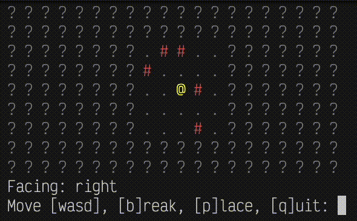

{fig-align="left" fig-alt="A 10 by 20 grid of characters printed to a terminal. Tiles are mostly question-mark characters (unknown tiles). Near the middle is an 'at' symbol (the player), surrounded within two tiles of periods (floor tiles) and hash marks (wall tiles). Underneath is a prompt for the player. The player moves around and destroys walls by inputting 'b' and builds them by typing 'p'." width="75%"}

## tl;dr

I messed around again with [tyle](https://github.com/matt-dray/tyle), my Python-CLI roguelike-like. 
Now it has godlike destruction and creation.

## The beast at Tanagra

Before now, you could install [tyle](https://github.com/matt-dray/tyle)[^install] and type `tyle` into your terminal to generate a tile-grid with a player, surrounded by floor (`.`) and wall (`#`) tiles, as well as 'fog of war' (`?`) beyond a certain distance.

```
? ? ? ? ? ? ? ? ? ? ? ? ? ? ? ? ? ? ? ? 
? ? ? ? ? ? ? ? ? ? ? ? ? ? ? ? ? ? ? ? 
? ? ? ? ? ? ? ? . . # . . ? ? ? ? ? ? ? 
? ? ? ? ? ? ? ? . . . . . ? ? ? ? ? ? ? 
? ? ? ? ? ? ? ? . . @ . . ? ? ? ? ? ? ? 
? ? ? ? ? ? ? ? . . . . . ? ? ? ? ? ? ? 
? ? ? ? ? ? ? ? . . . . . ? ? ? ? ? ? ? 
? ? ? ? ? ? ? ? ? ? ? ? ? ? ? ? ? ? ? ? 
? ? ? ? ? ? ? ? ? ? ? ? ? ? ? ? ? ? ? ? 
Move (WASD+Enter): 
```

What next? 
I wanted to start thinking about enemies, but I did this with [r.oguelike](https://github.com/matt-dray/r.oguelike) already and wanted to try something different first.

I'm old enough to remember when Minecraft was first cool.
What is Minecraft?
Break block make block.

We can mimic this in two dimensions pretty easily.

## Jinza, when the truth was uncovered

In tyle, the underlying map is a `TileGrid`-class object, which is just a list of lists of `Tile`-class objects.
These tiles currently take one of two values: they're traversable floor (`.`) or untraversable wall (`#`).

What if you could just... remove the obstruction?

Well now you can. For example:

```
? ? ? ? ? ? ? ? ? ? ? ? ? ? ? ? ? ? ? ? 
? ? ? ? ? ? ? ? ? ? ? ? ? ? ? ? ? ? ? ? 
? ? ? ? ? ? ? ? ? ? ? ? ? ? ? ? ? ? ? ? 
? ? ? ? ? ? ? ? . . . . . ? ? ? ? ? ? ? 
? ? ? ? ? ? ? ? . . . . . ? ? ? ? ? ? ? 
? ? ? ? ? ? ? ? . . @ # . ? ? ? ? ? ? ? 
? ? ? ? ? ? ? ? . . . . . ? ? ? ? ? ? ? 
? ? ? ? ? ? ? ? . . . . . ? ? ? ? ? ? ? 
? ? ? ? ? ? ? ? ? ? ? ? ? ? ? ? ? ? ? ? 
? ? ? ? ? ? ? ? ? ? ? ? ? ? ? ? ? ? ? ? 
Facing: right
Move [wasd], [b]reak, [p]lace, [q]uit: 
```

We're facing right and the adjacent tile is a wall.
Inputting <kbd>b</kbd> will <u>b</u>reak the wall.

```
? ? ? ? ? ? ? ? ? ? ? ? ? ? ? ? ? ? ? ? 
? ? ? ? ? ? ? ? ? ? ? ? ? ? ? ? ? ? ? ? 
? ? ? ? ? ? ? ? ? ? ? ? ? ? ? ? ? ? ? ? 
? ? ? ? ? ? ? ? . . . . . ? ? ? ? ? ? ? 
? ? ? ? ? ? ? ? . . . . . ? ? ? ? ? ? ? 
? ? ? ? ? ? ? ? . . @ . . ? ? ? ? ? ? ? 
? ? ? ? ? ? ? ? . . . . . ? ? ? ? ? ? ? 
? ? ? ? ? ? ? ? . . . . . ? ? ? ? ? ? ? 
? ? ? ? ? ? ? ? ? ? ? ? ? ? ? ? ? ? ? ? 
? ? ? ? ? ? ? ? ? ? ? ? ? ? ? ? ? ? ? ? 
Facing: right
Move [wasd], [b]reak, [p]lace, [q]uit: 
```

What's actually happening is that the tile adjacent to the player's direction is being replaced with a floor tile in the `TileGrid`.

To help the player, I've added to the UI a reminder of which way the player is facing, decided by the last direction of travel.

In `tile.py`, we can interpret an input of <kbd>b</kbd> to mean 'update the `Tile` in the specified location':

```python
if move == "b":
    row_change, col_change = direction_changes[self.direction]
    target_row = self.player.row + row_change
    target_col = self.player.col + col_change
    
    if not (
        0 <= target_row < self.n_rows and 0 <= target_col < self.n_cols
    ):
        return True

    target_tile = self.tiles[target_row][target_col]
    
    if target_tile.symbol == self.tileset["wall"]:
        self.tiles[target_row][target_col] = Tile(
            self.tileset["floor"], True
        )
    
    return True
```

In short: if the player submits <kbd>b</kbd>, then replace the tile in the direction they're facing with a floor tile.
This gives the illusion that the wall has been destroyed.

## Sokath, his eyes uncovered

Naturally, we can do this in reverse.
Instead of breaking a wall block, we can build one.

Pressing <kbd>p</kbd> will <u>p</u>lace a wall tile in the direction we're facing (right in this example).

```
? ? ? ? ? ? ? ? ? ? ? ? ? ? ? ? ? ? ? ? 
? ? ? ? ? ? ? ? ? ? ? ? ? ? ? ? ? ? ? ? 
? ? ? ? ? ? ? ? ? ? ? ? ? ? ? ? ? ? ? ? 
? ? ? ? ? ? ? ? . . . . . ? ? ? ? ? ? ? 
? ? ? ? ? ? ? ? . . . . . ? ? ? ? ? ? ? 
? ? ? ? ? ? ? ? . . @ # . ? ? ? ? ? ? ? 
? ? ? ? ? ? ? ? . . . . . ? ? ? ? ? ? ? 
? ? ? ? ? ? ? ? . . . . . ? ? ? ? ? ? ? 
? ? ? ? ? ? ? ? ? ? ? ? ? ? ? ? ? ? ? ? 
? ? ? ? ? ? ? ? ? ? ? ? ? ? ? ? ? ? ? ? 
Facing: right
Move [wasd], [b]reak, [p]lace, [q]uit: 
```

This requires a small change to the code, allowing for a wall `Tile` to be added to the `TileGrid` rather than removed:

```python
if move in ["b", "p"]:
    row_change, col_change = direction_changes[self.direction]
    target_row = self.player.row + row_change
    target_col = self.player.col + col_change
    
    if not (
        0 <= target_row < self.n_rows and 0 <= target_col < self.n_cols
    ):
        return True

    target_tile = self.tiles[target_row][target_col]
    
    if move == "b":
        if target_tile.symbol == self.tileset["wall"]:
            self.tiles[target_row][target_col] = Tile(
                self.tileset["floor"], True
            )
    
    if move == "p":
        if target_tile.symbol == self.tileset["floor"]:
            self.tiles[target_row][target_col] = Tile(
                self.tileset["wall"], False
            )
    
    return True
```

## Jerna, before the dawn

At the moment, destruction and creation are infinite (within the confines of the tilegrid).
You can break and build as many wall blocks as you like.
Such omnipotence.

In future I want to add this to an inventory system.
Break one wall? Now you can make one wall.
No more, no less.

Perfectly balanced.

### Environment {.appendix}

<details><summary>Session info</summary>
```{r sessioninfo, eval=TRUE, echo=FALSE}
cat(paste0("Last rendered:", format(Sys.time(), usetz = TRUE), "\n"), readLines("pyproject.toml"), sep = "\n")
```
</details>

[^install]: You could install the development version like `uv tool install git+https://github.com/matt-dray/tyle.git`. But don't install things from people you don't trust.